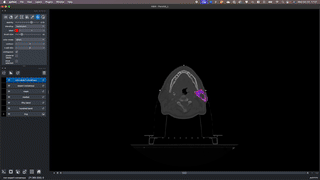
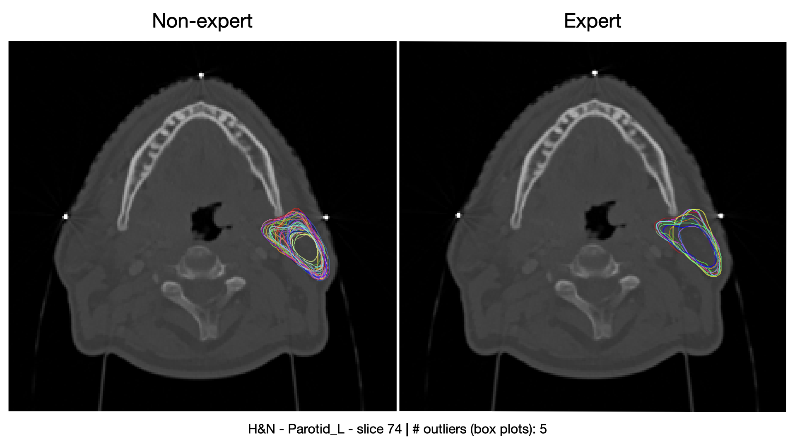
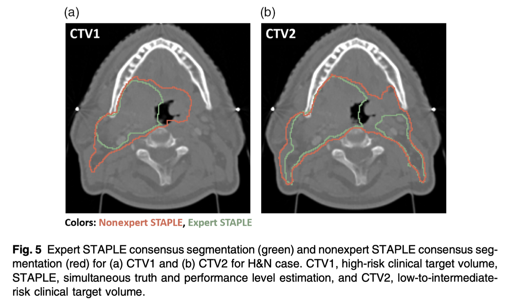
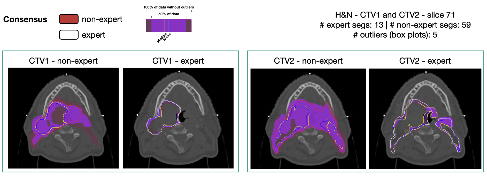
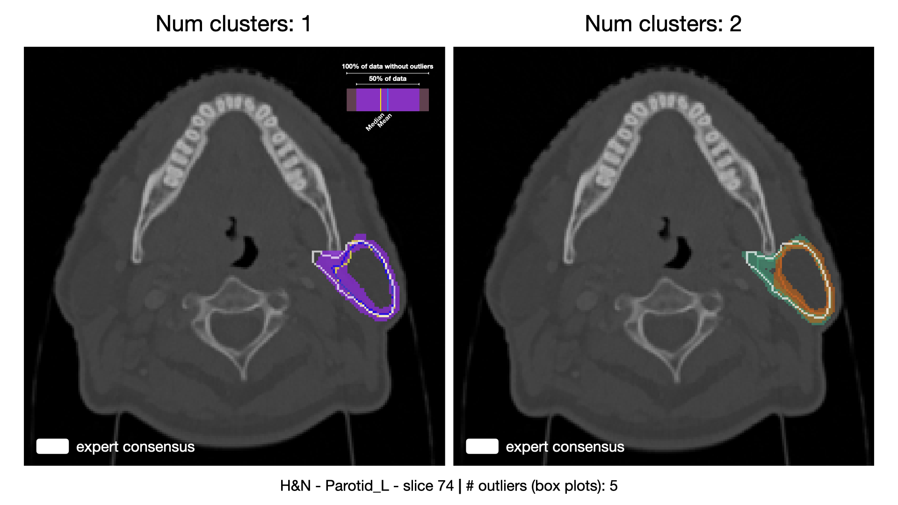

# Analysis of C3RO dataset using Contour Depth

In this demo we demonstrate the usage of contour-depth to analyze real three-dimensional contour ensembles. 
We use as case study the C3RO study [1], for which the data and analyses are available. 

## Setup

Data setup:
- Download the `Organized_files_v4` directory from [4]. A descriptor of the C3RO dataset is available at [2]. We explain relevant aspects of the data in the following section.
- Unzip the directory and rename it to `c3ro_dataset`.
- Place the `c3ro_dataset` directory in the root of the `napari_demo` directory.

Code setup:
- Ensure the `contour-depth` library is installed (see the root of this repo for instructions).
- Install necessary additional packages for the demo: `pip install "napari[all]"` and `pip install nibabel distinctipy`

## Analysis example

The C3RO dataset contains ensembles of segmentations by expert and non-expert clinicians for several anatomical sites and regions of interest within those sites. 
The figure below shows an example of such ensembles for left parotid gland in the head and neck region (H&N - Parotid_L) using spaghetti plots.

One of the main results of the C3RO study is that non-expert annotations can approximate expert performance if enough of them are used. 
This is exciting because it means one could use cheaper-to-obtain non-expert segmentations to train models without sacrificing performance.

Some instances in the data challenge this ambition. For instance, the figure below (taken from [1]) shows how for the CTV1 and CTV2 (H&N) the non-expert consensus is not close to the expert consensus. 

Using contour depth to remove outliers (5 in this case), we observe how the trimmed mean (blue line) of the non-expert ensemble now closely resembles the one obtained in the expert consensus.
This shows that cases originally used to warn where non-expert annotations might not be enough could improve in performance if post-processing is performed.

The demo also supports computing different modes of variation by affecting the `NUM_CLUSTERS` parameter. 
Disentangling the modes of variation could be used to offer the user, different candidates, from which to pick from.
The image below shows an example of such a use case for the left parotid (non-expert ensemble). 
As can be observed on the left, when using the uni-modal boxplot, the mean is far from the expert consensus.
Multi-modal depth separates the data into conservative and less conservative groups. 
It is possible to see how the conservative group now follows the expert consensus much more closely.

The demo demonstrates how the contour depth methods can be integrated into the analysis workflow.
We encourage the user to explore other regions of interest in the C3RO dataset, comparing the results obtained with the depth and the consensus data obtained with the STAPLE algorithm [5].
Finally, we believe the demo and the concepts it illustrates can be used in other contexts or further developed into an interactive segmentation tool. 

## References and materials

- [1] Lin, D., Wahid, K. A., Nelms, B. E., He, R., Naser, M. A., Duke, S., ... & Gillespie, E. F. (2023). E pluribus unum: prospective acceptability benchmarking from the Contouring Collaborative for Consensus in Radiation Oncology crowdsourced initiative for multiobserver segmentation. Journal of Medical Imaging, 10(S1), S11903-S11903.
- [2] Wahid, K. A., Lin, D., Sahin, O., Cislo, M., Nelms, B. E., He, R., ... & Gillespie, E. F. (2023). Large scale crowdsourced radiotherapy segmentations across a variety of cancer anatomic sites. Scientific data, 10(1), 161.
- [3] [Github code](https://github.com/kwahid/C3RO_analysis?tab=readme-ov-file) for the analysis of the C3RO study [1] 
- [4] [Data](https://figshare.com/articles/dataset/Large-scale_crowdsourced_radiotherapy_segmentations_across_a_variety_of_cancer_sites/21074182?file=42025569) of the C3RO study [1]
- [5] STAPLE algorithm: Warfield, S. K., Zou, K. H., & Wells, W. M. (2004). Simultaneous truth and performance level estimation (STAPLE): an algorithm for the validation of image segmentation. IEEE transactions on medical imaging, 23(7), 903-921.